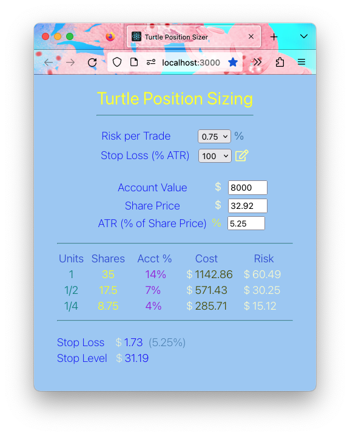

# turtle-position-sizer
A React App that calculates stop losses and position size according to the Turtle methodology. See [The Complete TurtleTrader](https://www.amazon.com/Complete-TurtleTrader-Investors-Overnight-Millionaires/dp/0061241717) for more information.

The Application calculates stop loss and unit size like this

	Stop Loss = ATR * %ATR/100 
	Stop Level = Share Price - Stop Loss 
	Number of Shares per Unit = (Account Value * Risk per Trade/100) / Stop Loss 

</img>

If you click the editing pencil, you can specify the stop level explicitly, like this.

</img>

To run the application

1. Clone the repository

2. In the directory created in step #1 execute the following commands

	
npm install
	 
	npm start
	

3. Access localhost:3000 in a browser
